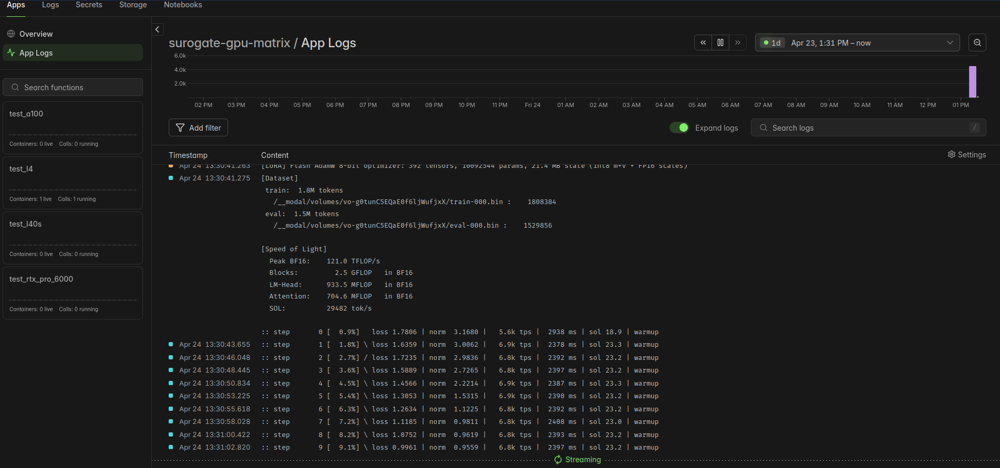
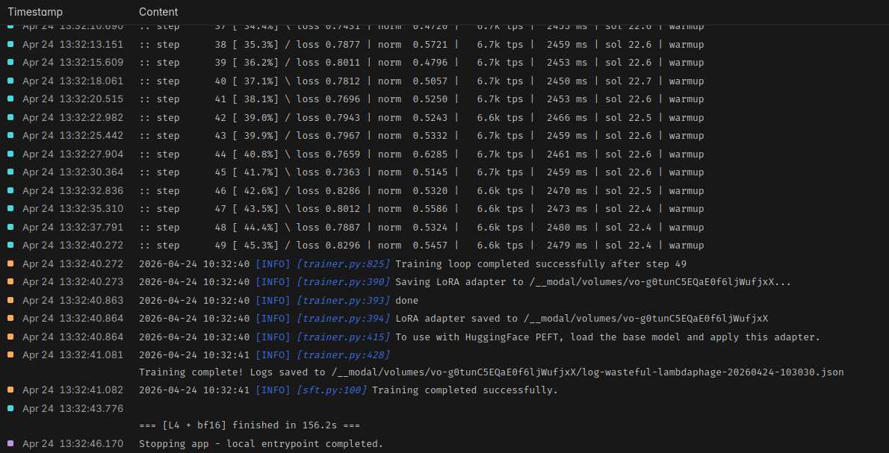

# Surogate SFT pe Modal

Ghid practic pentru antrenare (SFT - Supervised Fine-Tuning) cu
[Surogate](https://docs.surogate.ai) pe GPU închiriat de la
[Modal](https://modal.com). Include 4 rulări gata făcute pe 4 GPU-uri
diferite, cu dataset-ul românesc `OpenLLM-Ro/ro_gsm8k`.

**Structura repo-ului:**

| Fișier                         | Rol                                                            |
| ------------------------------ | -------------------------------------------------------------- |
| `run_gpu_test.py`              | Script Modal cu 4 funcții, una pe GPU - rulează SFT            |
| `configs/bf16.yaml`            | Config SFT recipe **bf16** (merge pe orice GPU)                |
| `configs/fp8.yaml`             | Config SFT recipe **fp8-hybrid** (Ada+)                        |
| `configs/nvfp4.yaml`           | Config SFT recipe **nvfp4** (doar Blackwell)                   |
| `scripts/merge_checkpoint.py`  | Script Modal care combină LoRA-ul cu modelul de bază           |
| `images/`                      | Screenshot-uri din Modal de la rulările de referință           |

---

## 1. Setup

**Pasul 0 - cont Modal.** Înainte de orice, intră pe
[modal.com](https://modal.com) și fă-ți cont (gratuit, iți dă $30 credit
lunar). Fără cont, `modal token new` nu are unde să te autentifice.

**Pasul 1 - venv + modal.** Din folderul repo-ului:

```bash
uv venv --python 3.12                # creează .venv/ cu Python 3.12
source .venv/bin/activate            # activează mediul virtual
uv pip install modal                 # instalează Modal CLI + SDK
```

> Dacă n-ai `uv`, îl instalezi cu `curl -LsSf https://astral.sh/uv/install.sh | sh`.
> Alternativ, poți folosi `python3.12 -m venv .venv && pip install modal`.

**Pasul 2 - autentificare.** Încearcă:

```bash
modal token new                      # deschide browserul, te loghezi, salvează token-ul
```

Dacă din vreun motiv `modal` nu e pe PATH, rulează varianta echivalentă:

```bash
python -m modal setup
```

**Verifică:**

```bash
modal profile current                 # ar trebui să afișeze username-ul tău Modal
```

---

## 2. Alege GPU-ul

Modal nu oferă RTX 5090. Tabelul complet al GPU-urilor și ce recipe
Surogate suportă fiecare:

| GPU Modal     | VRAM   | bf16 | fp8-hybrid | nvfp4 | $/oră |
| ------------- | ------ | ---- | ---------- | ----- | ----- |
| T4            | 16 GB  | ✓    | ✗          | ✗     | 0.59  |
| L4            | 24 GB  | ✓    | ✓          | ✗     | 0.80  |
| A10           | 24 GB  | ✓    | ✗          | ✗     | 1.10  |
| L40S          | 48 GB  | ✓    | ✓          | ✗     | 1.95  |
| A100-40GB     | 40 GB  | ✓    | ✗          | ✗     | 2.10  |
| **A100-80GB** | 80 GB  | ✓    | ✗          | ✗     | 2.50  |
| RTX PRO 6000  | 96 GB  | ✓    | ✓          | ✓     | 3.03  |
| **H100**      | 80 GB  | ✓    | ✓          | ✗     | 3.95  |
| H200          | 141 GB | ✓    | ✓          | ✗     | 4.54  |
| B200          | 180 GB | ✓    | ✓          | ✓     | 6.25  |

Multi-GPU: adaugă `:N` la string (ex. `"H100:2"` pentru 2× H100).

**Recomandări scurte pentru SFT:**

- **Buget** → `L4` (bf16) sau `L40S` (fp8-hybrid).
- **Default solid** → `A100-80GB` (bf16) sau `H100` (fp8-hybrid).
- **Modele mari / context lung** → `H200`, `B200`.

---

## 3. Rulează o rulare de referință

Cele 4 entry-points din `run_gpu_test.py` au fost rulate și verificate
end-to-end. Le pornești individual:

```bash
modal run run_gpu_test.py::test_l4              # L4  + bf16    (~2.5 min)
modal run run_gpu_test.py::test_l40s            # L40S + fp8    (~1 min)
modal run run_gpu_test.py::test_a100            # A100 + bf16   (~1 min)
modal run run_gpu_test.py::test_rtx_pro_6000    # RTX PRO + nvfp4 (~45 s)
```

Prima rulare construiește imaginea Docker în Modal (~3 min, se
cache-uiește). Următoarele rulări pornesc containerul în ~10 s.

**Cum arată când rulează în Modal** (UI-ul Modal, tab `Logs`):



---

## 4. Rezultate ale celor 4 rulări (Qwen3-0.6B + LoRA, 50 pași)

| #   | GPU          | Config                                     | Timp  | Throughput  | Loss start → final |
| --- | ------------ | ------------------------------------------ | ----- | ----------- | ------------------ |
| 1   | L4           | [`configs/bf16.yaml`](configs/bf16.yaml)   | 156 s | 6.7k tok/s  | 1.78 → 0.83        |
| 2   | L40S         | [`configs/fp8.yaml`](configs/fp8.yaml)     | 61 s  | 25.4k tok/s | 1.81 → 0.84        |
| 3   | A100-80GB    | [`configs/bf16.yaml`](configs/bf16.yaml)   | 59 s  | 22.0k tok/s | 1.78 → 0.83        |
| 4   | RTX PRO 6000 | [`configs/nvfp4.yaml`](configs/nvfp4.yaml) | 45 s  | 39.6k tok/s | 1.85 → 0.89        |

### Detalii scurte pe fiecare

**1. L4 + bf16** - cea mai ieftină opțiune. Throughput redus dar loss
identic cu GPU-urile mari (bf16 e determinist). Bun pentru verificări.

**2. L40S + fp8-hybrid** - sweet spot calitate/preț: peak BF16 362 TFLOP/s,
peak FP8 733 TFLOP/s. ~2.5× mai rapid decât L4 pentru același rezultat.

**3. A100-80GB + bf16** - aceeași viteză ca L40S, dar 80 GB VRAM → poți
antrena modele mult mai mari (LoRA pe ~30B sau full fine-tune pe ~3B).

**4. RTX PRO 6000 + nvfp4** - cea mai rapidă (39.6k tok/s). Pipeline-ul
CUTLASS FP4 e primat automat ("FP4 cache primed: 96 fwd + 96 bwd").
Loss puțin mai mare - compromis așteptat pentru precizie 4-bit.

**Cum arată la final** (LoRA salvat, training complete):



---

## 5. Descarcă rezultatele

```bash
modal volume ls surogate-outputs              # listează conținutul volumului
modal volume get surogate-outputs / ./out     # descarcă-l local în ./out/
```

Ce găsești în volum după un run:

| Fișier                            | Rol                                  |
| --------------------------------- | ------------------------------------ |
| `adapter_model.safetensors`       | Weights-urile LoRA (adapterul antrenat) |
| `adapter_config.json`             | Meta-date LoRA (rank, alpha, etc.)   |
| `log-<nume-run>-<timestamp>.json` | Log complet cu toți pașii            |
| `training_plot.png`               | Graficul cu loss-ul                  |
| `train-000.bin`, `eval-000.bin`   | Dataset tokenizat (cache)            |
| `.tokenize_hash`                  | Hash pentru invalidare cache         |

> ⚠️ **Atenție:** toate rulările scriu în același `output_dir`, deci
> `adapter_model.safetensors` se **suprascrie** la fiecare run. Ca să
> păstrezi mai multe checkpoint-uri, schimbă `output_dir` în YAML
> (ex. `/output/l40s-fp8-run1`) sau folosește volume separate.

---

## 6. Merge LoRA - obține modelul gata de servit

După antrenament ai doar adapter-ul LoRA (~20 MB). Ca să-l folosești cu
`AutoModelForCausalLM` (transformers, vLLM, etc.) trebuie să-l combini
cu modelul de bază.

### Varianta recomandată - automat, din YAML

Surogate face merge-ul **la sfârșitul antrenamentului** dacă adaugi în
config:

```yaml
merge_adapter: true
```

(default e `false`). Când e activ, după ultimul pas Surogate salvează în
`output_dir` **și** adapter-ul LoRA **și** modelul combinat - deci nu mai
ai nevoie de script extern.

### Varianta manuală - când NU ai setat `merge_adapter`

Dacă ai antrenat fără `merge_adapter: true` (sau vrei să combini un
checkpoint vechi cu alt model de bază), `scripts/merge_checkpoint.py`
face merge-ul pe Modal, folosind Python-ul Surogate din container (nu
trebuie instalat nimic local).

```bash
modal run scripts/merge_checkpoint.py \
    --base-model Qwen/Qwen3-0.6B \
    --checkpoint-dir /output \
    --output /output/merged
```

Argumente:

| Argument            | Ce e                                                                       |
| ------------------- | -------------------------------------------------------------------------- |
| `--base-model`      | HF id (`Qwen/Qwen3-0.6B`) sau un director local cu modelul de bază         |
| `--checkpoint-dir`  | Director cu `adapter_model.safetensors` + `adapter_config.json`            |
| `--output`          | Unde se scrie modelul combinat (tot în Volume → persistă între rulări)     |

După merge, descarci modelul local:

```bash
modal volume get surogate-outputs /merged ./merged
```

**Intern:** Python-ul Modal nu are acces la `surogate` (e instalat într-un
venv separat, `/opt/surogate/.venv/`). Script-ul apelează acel Python cu
`subprocess`, care face `from surogate.utils.adapter_merge import
merge_adapter` și combină weights-urile LoRA direct în straturile modelului.

---

## 7. Parametrii cei mai importanți din YAML (scurt)

Pentru detalii complete vezi
[documentația Surogate](https://docs.surogate.ai/guides/configuration).

| Parametru                     | Ce face                                                                             |
| ----------------------------- | ----------------------------------------------------------------------------------- |
| `model`                       | HF id al modelului de bază, ex. `Qwen/Qwen3-0.6B`, `meta-llama/Llama-3.1-8B`        |
| `datasets[].path`             | HF id sau cale locală `.jsonl`; `type: auto` detectează formatul                    |
| `recipe`                      | `bf16` (orice GPU) / `fp8-hybrid` (Ada+) / `nvfp4` (Blackwell)                      |
| `max_steps`                   | Număr total de pași. 50 = smoke test; 500-5000 = antrenament real                   |
| `per_device_train_batch_size` | Exemple per GPU per pas. Crește dacă ai VRAM, scade dacă OOM                        |
| `gradient_accumulation_steps` | Acumulează gradienți peste N mini-batches (batch efectiv = batch × accum)           |
| `sequence_len`                | Lungime maximă în tokeni. 2048 standard; 4096/8192 pentru context lung, crește VRAM |
| `sample_packing`              | `true` = împachetează documente în aceeași secvență (mult mai eficient)             |
| `learning_rate`               | LoRA: `2e-4`. Full fine-tune: `1e-5 … 5e-5`. Prea mare = divergență                 |
| `warmup_ratio`                | Procent din pași cu LR crescând liniar de la 0. Tipic 0.05–0.15                     |
| `lora`                        | `true` = antrenează adaptori peste model înghețat (rapid, VRAM mic)                 |
| `lora_rank`                   | Dimensiunea matricilor LoRA. Tipic 8–64. Mai mare = mai multă capacitate + VRAM     |
| `lora_alpha`                  | Factor de scalare (convenție: `2 * lora_rank`)                                      |
| `lora_target_modules`         | Ce straturi primesc adaptori. Lista din configuri = "all-linear" pentru Qwen        |

**LoRA pe scurt:** înghețăm modelul de bază, antrenăm doar niște matrici
mici (low-rank) care se adaugă la atenție/MLP. Economisim ~90% VRAM față
de full fine-tune, cu rezultate foarte apropiate pentru adaptare pe
domenii specifice.

---

## 8. Modificări tipice

- **Alt dataset:** în YAML, `datasets[0].path` → HF id (ex.
  `tatsu-lab/alpaca`) sau cale `/workspace/my.jsonl`. Dacă folosești JSONL
  local, adaugă-l în imagine cu
  `image.add_local_file("data.jsonl", "/workspace/data.jsonl")`.
- **Alt model:** `model: <HF_ID>`. Pentru modele mai mari (7B+) verifică
  că GPU-ul are VRAM suficient; scade `per_device_train_batch_size` dacă e
  cazul.
- **Mai mulți pași:** `max_steps: 1000` (sau șterge linia pentru 1 epocă
  completă).
- **Altă precizie:** schimbă `recipe:` și alege GPU din tabelul de la
  secțiunea 2.
- **Alt GPU:** adaugă o funcție nouă în `run_gpu_test.py`:
  ```python
  @app.function(gpu="H100", **_fn_kwargs)
  def test_h100():
      _train("/workspace/fp8.yaml", "H100 + fp8-hybrid")
  ```
  Apoi `modal run run_gpu_test.py::test_h100`.

---

## 9. Debugging - probleme întâlnite și soluții

Au apărut în timpul validării acestui ghid - dacă le vezi, iată fix-urile:

| Eroare                                                      | Cauză                                              | Fix                                                                         |
| ----------------------------------------------------------- | -------------------------------------------------- | --------------------------------------------------------------------------- |
| `wheel is compatible with manylinux_2_39, you're on 2_35`   | Base image Ubuntu 22.04 (glibc prea vechi)         | Folosește `nvidia/cuda:12.8.0-devel-ubuntu24.04`                            |
| `curl is required but not installed` (deși curl e prezent)  | Installer-ul e bash, dar l-ai pipe-uit la `sh`     | Schimbă `\| sh` → `\| bash`                                                 |
| `ModuleNotFoundError: No module named 'grpclib'` la runtime | Ai pus venv-ul Surogate pe PATH → ascunde Modal    | Nu suprascrie PATH; apelează `/opt/surogate/.venv/bin/surogate` direct      |
| `image tried to run a build step after add_local_*`         | `run_commands` sau `workdir` după `add_local_file` | Pune `add_local_file(...)` la SFÂRȘITUL pipeline-ului de build              |
| `CUDA out of memory` în timpul antrenamentului              | Batch prea mare sau `sequence_len` prea lung       | Scade `per_device_train_batch_size` sau `sequence_len`; crește `grad_accum` |
| Installer-ul Surogate cere CUDA la build                    | Modal build fără GPU nu detectează CUDA            | Pune `gpu="T4"` pe `run_commands` unde rulezi installer-ul                  |

---

## 10. Tips

- **Cache-ul imaginii** - Modal rebuildește doar ce s-a schimbat. Dacă
  editezi doar YAML-urile, se recompune doar layer-ul `add_local_file`
  (secunde). Dacă schimbi `run_commands`, se face build complet (~3 min).
- **Cache-ul dataset-ului** - tokenizarea `OpenLLM-Ro/ro_gsm8k` se salvează
  în volum după prima rulare. Rulările ulterioare o reutilizează (log:
  _"Tokenization hash unchanged ..."_).
- **Loss determinist** - rulările bf16 pe L4 și A100 dau EXACT același
  loss per pas (seed fix, operații deterministe). Util pentru debugging.
- **Cost real** - în acest repo toate 4 rulările împreună au costat mai
  puțin de $0.30. Nu ezita să experimentezi.
- **Observă `SOL`** - "Speed of Light" din log e procent din peak-ul
  teoretic al GPU-ului. >20% e sănătos pentru modele mici; <5% = problemă.

---

## 11. Referințe

- Documentația Surogate: https://docs.surogate.ai
- Exemple SFT oficiale:
  https://github.com/invergent-ai/surogate/tree/main/examples/sft
- Documentația Modal (GPU, Volumes, Images):
  https://modal.com/docs
- Dataset folosit: https://huggingface.co/datasets/OpenLLM-Ro/ro_gsm8k
